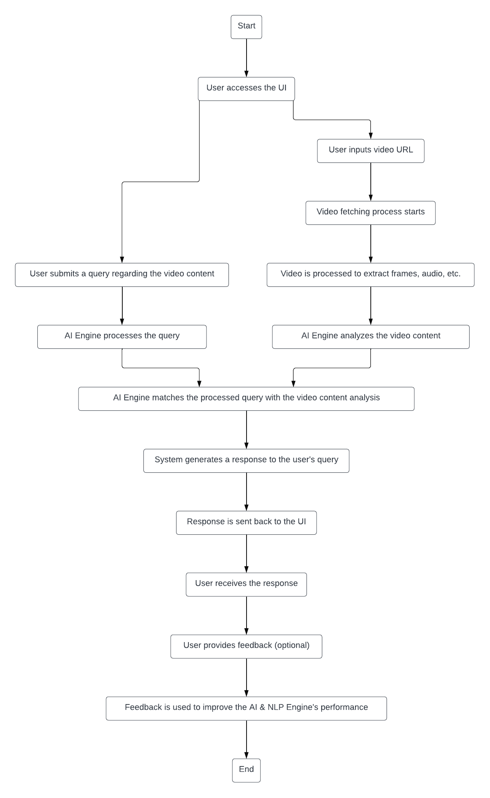

# **Video GPT Project - High-Level Design Document**

## **Revision History**

| Version | Date       | Description of Changes              | Author(s)          |
|---------|------------|-------------------------------------|--------------------|
| 1.0.0   | 2024-02-04 | Initial creation of the HLD         | Ashrith Prakash    |

## **Document Information**

- **Title:** High-Level Design for Video GPT
- **Version:** 1.0.0
- **Date:** 2024-02-04
- **Document Owner:** Ashrith Prakash
- **Authors:** Ashrith Prakash

## **Table of Contents**

1. Introduction
2. System Overview
3. Functional Requirements
4. Non-Functional Requirements
5. Architecture Design
6. Data Design
7. Key APIs
8. Overall Approach
9. Security

## **1. Introduction**

### **Purpose**

The purpose of this document is to outline the high-level design for the Video GPT project. This project aims to develop a backend system that enables users to interact with video content through natural language queries. This document is intended for project stakeholders, including project managers, developers, and investors.

### **Scope**

This HLD covers the conceptual design of the system, including the architecture, key components, database design, API endpoints, and the overall approach for implementation. It outlines both functional and non-functional requirements and provides initial estimations for project scope, resources, and timelines.

## **2. System Overview**

The Video GPT system is designed to revolutionize how users interact with video content by enabling them to ask questions and receive information based on video analysis. The system will leverage advanced AI models to understand and generate responses to user queries, providing a seamless and interactive experience.

### **Simple Diagram and Description**

- **User Interface (UI):** A web or mobile interface for user interactions, allowing users to submit video URLs and queries.
- **Backend Server:** Handles API requests, manages user authentication, and orchestrates the video processing and query handling workflows.
- **Video Processing Module:** Responsible for fetching videos from provided URLs, extracting frames, and preprocessing data for further analysis.
- **AI & NLP Engine:** Analyzes the video content and processes user queries to generate relevant responses based on the video's context and content.
- **Database:** Manages the storage of user data, video metadata, query logs, and analysis results, ensuring fast retrieval and secure storage.

## **3. Functional Requirements**

1. **Video Processing and Analysis:**
 - The system must be able to fetch videos from given URLs.
 - It should process and analyze video content to extract meaningful information, such as speech, text, objects, and scene changes.
2. **Query Processing:**
 - Users should be able to submit queries related to the video content.
 - The system must interpret these queries and provide relevant responses based on the video analysis.
3. **User Interaction:**
 - Users must be able to register, login, and manage their accounts.
 - The system should provide an interface for users to submit video URLs and queries, and to receive responses.
4. **Response Generation:** 
 - It generates responses to queries based on the content analysis of the submitted videos.
5. **Data Storage:**
 - The system must store user data, including their queries and interaction history, securely.
 - Video metadata extracted from the analysis should be stored efficiently for quick retrieval in response to queries.

## **4. Non-Functional Requirements**

1. **Performance:**
 - The system must provide timely responses to user queries, aiming for minimal latency in video processing and query response generation.
 - It should be optimized for efficient processing and analysis of video content.
2. **Scalability:**
 - The system must be scalable, capable of handling an increasing number of users and queries without degradation in performance.
 - It should support scaling of video processing capabilities to accommodate larger or more complex video files.
3. **Reliability:**
 - Ensure high availability of the service, with minimal downtime.
 - The system should handle errors gracefully and maintain operational integrity under various conditions.
4. **Usability:**
 - The user interface must be intuitive and user-friendly, allowing users to easily navigate and use the system without extensive training.

## **5. Architecture Design**

The Video GPT system uses a microservices architecture, with services for user management, video processing, AI analysis, and query response generation. These components interact over a RESTful API, ensuring modularity and scalability.

### Workflow
1. User inputs a video URL and submits a query through the UI.
2. The backend server receives the request and forwards it to the video processing module.
3. The video processing module fetches the video, processes it, and extracts relevant data.
4. The AI & NLP engine receives processed video data and the user's query, performs analysis, and generates a response.
5. The response is sent back to the UI to be displayed to the user.

### **Flow Chart**
  
  

## **6. Data Design**

### **Data Models**

- **Users Table**
  - Columns: `UserID`, `Username`, `Email`, `PasswordHash`, `DateCreated`
- **Videos Table**
  - Columns: `VideoID`, `URL`, `Title`, `Description`, `DateAdded`
- **Queries Table**
  - Columns: `QueryID`, `UserID`, `VideoID`, `QueryText`, `ResponseText`, `Timestamp`
- **VideoAnalysis Table**
  - Columns: `AnalysisID`, `VideoID`, `FrameData`, `TextData`, `ObjectData`, `Timestamp`

## **7. Key APIs**

### **User Management**
```jsx
// Endpoint for user registration
Endpoint: /user/register
Method: POST
Description: Registers a new user.
Request: { "username": "user", "email": "user@example.com", "password": "password123" }
Response: { "userId": "456", "status": "registered" }
```
### **Video Processing**
```jsx
// Endpoint for video upload
Endpoint: /video/upload
Method: POST
Description: Uploads a video URL for processing.
Request: { "url": "https://example.com/video.mp4" }
Response: { "videoId": "123", "status": "processing" }
```

### **Query Handling**
```jsx
// Endpoint for submitting a query about a video
Endpoint: /video/query
Method: POST
Description: Submits a query about a video.
Request: { "videoId": "123", "query": "What is the main topic?" }
Response: { "response": "The main topic is AI advancements." }
```


## **8. Overall Approach**

### Implementation Strategy

- **Technologies & Tools:**
  - **Backend:**  Node.js/Express or any suitable backend framework
  - **Video Processing:** OpenCV, FFmpeg for video frame extraction and preprocessing.
  - **AI & NLP Engine:** TensorFlow, PyTorch for building custom models, or use pre-trained models like OpenAI's GPT for text processing.
  - **Database:** MongoDB for storing video metadata and analysis results; PostgreSQL for structured data like user information.
  - **Frontend:** React, chosen for its component-based architecture.

- **Rationale Behind Key Decisions:**
  - **Microservices Architecture:** Ensures scalability and modularity.
  - **Local Development with Docker:** Facilitates easy transition to cloud platforms and ensures consistency across environments.
  - **API-First Design:** Provides flexibility and ease of integration with other applications or services.

### Scalability & Performance

- Design the system to handle a high volume of concurrent users and queries.
- Use efficient data storage and retrieval techniques to minimize response times.

## **9. Security**
TBD
